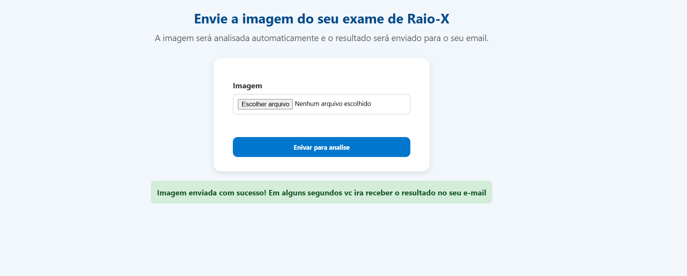
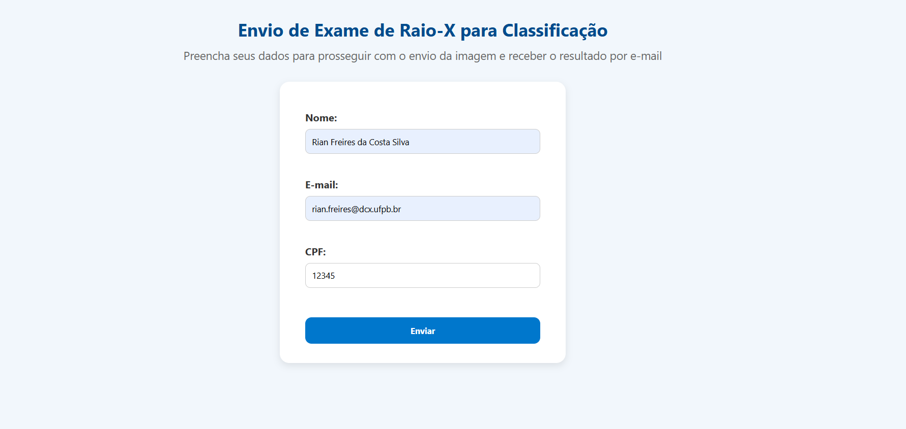

# 🫁 Classificador de Pneumonia por Imagem de Raio-X

Este projeto utiliza uma **Rede Neural Convolucional (CNN)** para classificar imagens de raio-X como **Normal** ou **Pneumonia**, com deploy feito em **Flask** para uma interface web simples e funcional.

---

## 🚀 Objetivo

Desenvolver um sistema de apoio à análise médica que:

- Classifique imagens de tórax como **"Normal"** ou **"Pneumonia"**.
- Permita o **envio de exames via navegador**.
- Envie automaticamente o **resultado da análise para o e-mail do usuário**.

---

## 🧠 Modelo Utilizado

O modelo foi construído usando **TensorFlow/Keras** com uma arquitetura CNN composta por:

- Camadas convolucionais com ReLU
- MaxPooling
- Dropout
- Camadas densas finais com ativação sigmoide (para saída binária)

A rede foi treinada com o conjunto de dados **Chest X-Ray Images (Pneumonia)**, contendo imagens categorizadas como `NORMAL` ou `PNEUMONIA`.

---

## 🖥️ Funcionalidades do Sistema Web

1. O usuário informa seu **nome, e-mail e CPF**.
2. Após isso, é direcionado para a tela de **upload da imagem de raio-X**.
3. O modelo faz a **predição automática**.
4. O sistema envia o **resultado para o e-mail informado**, indicando se foi identificado quadro de **Pneumonia** ou **Normal**.

---

## 🗂 Estrutura do Projeto

```

project/
├── app/
│   ├── static/              # CSS
│   ├── templates/           # HTMLs (formulários e upload)
│   ├── model/               # Arquivo .h5 do modelo treinado
│   ├── main.py              # Inicializa o app Flask
├── Data/                    # Os dados das imagens
│   ├── train/
│   ├── test/
├── Images/                  # Capturas das telas do sistema
│   ├── home.png             # Tela inicial (formulário dados usuário)
│   └── upload.png           # Tela de upload de imagem
├── treinamentoDoModelo.ipynb  # Notebook do treinamento do modelo
├── .gitignore                 # Arquivo de configuração do Git
├── README.md


````

---

## 📸 Visualização das Telas do Sistema

| Tela Inicial (Cadastro)                            | Tela de Upload de Imagem                      |
|--------------------------------------------------|-----------------------------------------------|
|                           |                    |

---

## ⚙️ Como rodar localmente

1. Clone o repositório:
```bash
git clone https://github.com/seuusuario/seurepositorio.git
````

2. Execute o app Flask:

```bash
python -m app.main
```

3. Acesse pelo navegador:

```
http://127.0.0.1:5000
```

---

## 📧 Contato

Caso tenha dúvidas ou sugestões, entre em contato:

**Rian Freires da Costa Silva**
📫 \[[Emial:](mailto:rianfreires40@gmail.com)]
🔗 \[[Linkedin:](www.linkedin.com/in/rian-freires-da-costa-silva-798813324)]

